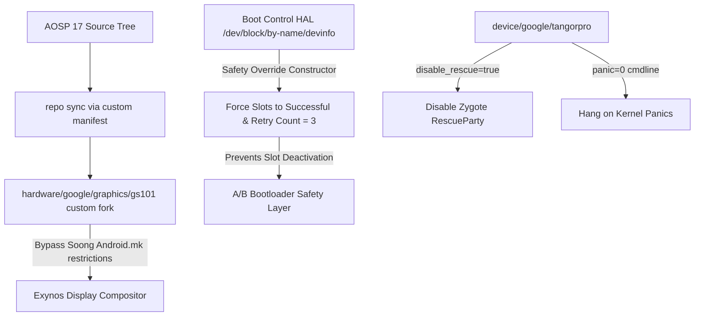

# Porting Android Automotive OS (AAOS) 17 to the Pixel Tablet (Tangorpro)

This repository contains the central configuration manifest and instructions for porting and building **Android Automotive OS 17 (AOSP 17.0.0_r1)** for the Google Pixel Tablet (`tangorpro`). 

Our port includes custom adaptions for Kernel driver modules, GPU compositor overrides, Vehicle and Audio HALs configs, and widescreen touch layouts.

---

## Technical Architecture Overview



---

## 1. Initial Build Environment Setup

To synchronize the workspace with our custom device trees, vendor cores, and patched HALs, use the central manifest repository:

```bash
# 1. Initialize Repo using the custom manifest branch
repo init -u https://github.com/a17-tangorpro-aaos/manifest.git -b android-17.0.0_r1-tangorpro

# 2. Sync all repository modules
repo sync -c -j$(nproc)
```

---

## 2. Driver & System Customizations

Porting AAOS 17 to a mobile-oriented Pixel tablet required modifying several core subsystems and hardware drivers:

### A. Kernel & UFS Storage Drivers (`device/google/tangorpro-kernels/6.1`)
Stock AOSP builds do not package proprietary boot modules. We integrated Tensor G2 Kernel `6.1` boot modules (like `ufs` storage controller and `giga-physical-layer` flash drivers) to enable system mounting:
```xml
<project path="device/google/tangorpro-kernels/6.1" name="device/google/tangorpro-kernels/6.1" revision="main" clone-depth="1" />
```

### B. Hardware GPU Acceleration Compositor (`gs101`)
To bypass Soong build errors onExynos compositor legacy code:
1. Created a fork at `https://github.com/a17-tangorpro-aaos/hardware_google_graphics_gs101`.
2. Renamed the block file `Android.mk` &rarr; `Android.mk.bak`.
3. Enabled **60fps hardware-accelerated drawing** (avoiding slow CPU software rendering).

### C. Touch Digitizer Configurations
Widescreen coordinate mappings for touch inputs were injected into the build system:
* **Files:** `NVTCapacitiveTouchScreen.idc`, `NVTCapacitivePen.idc`
* **Output Path:** `/vendor/usr/idc/`

### D. Automotive Bluetooth & Audio HAL Groups
* **Bluetooth Roles:** Inverted roles (mobile hands-free profile gateway) to auto HFP sink roles via system-level overlays (`WifiOverlayT6pro`).
* **Audio HAL:** Grouped system routing outputs into multizone automotive audio groups, avoiding target crash-loops on boot.

---

## 3. Developing "Brick-Proof" Boot Protection

To prevent active boot slots from deactivating during system development, we implemented a 3-layer safety system:

### A. Disable Rescue Party
User-space system crashes usually force an automatic recovery reboot loop. We disabled this feature in system properties:
* **File:** `device/google/tangorpro/device-tangorpro.mk`
* **Patch:**
  ```makefile
  # Disable RescueParty to prevent automatic recovery loops
  PRODUCT_PROPERTY_OVERRIDES += \
      persist.sys.disable_rescue=true
  ```

### B. Freezing on Kernel Panics
Instead of reboot loops, we force the kernel to hang on the boot screen if it panics. This allows developers to easily collect logs or enter bootloader mode:
* **File:** `device/google/tangorpro/tangorpro/BoardConfig.mk`
* **Patch:**
  ```makefile
  BOARD_KERNEL_CMDLINE += panic=0 swiotlb=noforce
  ```

### C. Boot Control HAL Overrides (AIDL & HIDL 1.2)
We modified Google's boot control logic to intercept slot deactivation attempts and reset boot counts to **`3`** as soon as the HAL initializes:
* **Files:** 
  * `device/google/gs-common/bootctrl/1.2/BootControl.cpp`
  * `device/google/gs-common/bootctrl/aidl/BootControl.cpp`
* **HAL Constructor Modifications:**
  Forces active attributes on early init:
  ```cpp
  BootControl::BootControl() {
      CHECK(InitMiscVirtualAbMessageIfNeeded());
      if (isDevInfoValid()) {
          for (int i = 0; i < 2; i++) {
              devinfo.ab_data.slots[i].unbootable = 0;
              devinfo.ab_data.slots[i].retry_count = 3; // Reset retry count
              devinfo.ab_data.slots[i].successful = 1;  // Force successful
          }
          DevInfoSync();
      }
  }
  ```

---

## 4. Compiling the AAOS System Images

```bash
# Setup build profile env
. build/envsetup.sh

# Select Pixel Tablet tangorpro staging userdebug target
lunch aosp_tangorpro_car-trunk_staging-userdebug

# Build the images
m
```

---

## 5. Flashing and Live System Verification

### A. Full Flashing
Connect the tablet, boot it into the bootloader, and flash:
```bash
export ANDROID_PRODUCT_OUT=out/target/product/tangorpro
fastboot flashall
```

### B. Writable Developers Remount (Pushing incremental HAL updates)
Instead of flashing full vendor images, you can write active build binaries to the running tablet using `adb remount`:
```bash
# 1. Compile the boot HAL target specifically
m android.hardware.boot-service.default-pixel

# 2. Disable system integrity on the tablet
adb root
adb disable-verity
adb reboot

# 3. Once booted, mount partitions as writable and push updated binary
adb wait-for-device
adb root
adb remount
adb push out/target/product/tangorpro/vendor/bin/hw/android.hardware.boot-service.default-pixel /vendor/bin/hw/
adb shell chmod 755 /vendor/bin/hw/android.hardware.boot-service.default-pixel
adb reboot
```

### C. Live Partition Verification
Check kernel output logs (`dmesg`) to verify the HAL initialized:
```bash
adb shell "su 0 dmesg" | grep -i bootcontrolhal
```
*Expected Output:*
```text
[    3.260037] bootcontrolhal: BootControl safety patch (AIDL): forcing slots to be bootable and successful
```

Read the raw bytes inside `/dev/block/by-name/devinfo` (offset 48) to confirm active partition states:
```bash
adb shell od -j 48 -N 8 -t x1 /dev/block/by-name/devinfo
```
*Expected Output:*
```text
0000060 03 0e 00 00 03 02 00 00
```
*(Confirms Slot A and B retry counts are set to `03` &rarr; `3`, and Slot A boot flags are healthy `0e`).*
